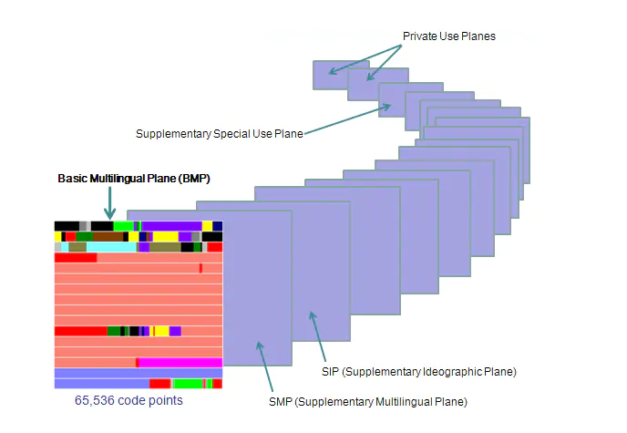

# 字符编码

**什么是编码？**

本质上，计算机只是存储和处理二进制数字。为了在计算机上表示、存储和处理文字和符号等字符，需要将其转换成二进制数字。而编码就是一种规则，用来规定如何转换这些特定的信息。在创建Unicode之前，有上百种指定这些数字的编码系统，然而没有一种编码可以包含足够的字符。同时，这些编码系统也会相互冲突，两种编码可能会使用相同的数字代表不同的字符，或使用不同的数字代表相同的字符。

常见的字符编码方案有：**ASCII**、**Latin-1**、GB系列（**GB2312**、**GBK**、**GB18030**）、**Big5**、**Unicode**等。

## ASCII

ASCII（American Standard Code for Information Interchange，美国信息交换标准代码）是基于拉丁字母的一套电脑编码系统。ASCII由电报码发展而来，是美国在上世纪60年代制定的一种标准的单字节的字符编码方案，至今为止共定义了128个字符（其中32个为不能显示的控制字符），只使用了7个二进制位表示，最高位为0。ASCII的局限在于只能显示26个基本拉丁字母、阿拉伯数字和英式标点符号。因此现代英语用128个字符来编码是完全足够的，然而对于其他非英语字符，128个字符是远远不够的。所以出现了很多非ASCII的编码的，但大多数都是兼容ASCII的。


## Latin-1

由于欧洲很多国家所用到的字符中，除了基本的、美国也用的那128个ASCII字符外，还有很多衍生的拉丁字母等字符和欧洲各国特有的字符。由于一个字符能够表示的编码实际上有256个，而ASCII只用到一个字节中的低7位，而后的128个编码相当于闲置。因此欧洲各国纷纷打起了后面这128个编码的主意，然而各国对这128个编码对应什么字符都有各自不同的设计。为了统一此前各国语言单独编码的混乱局面，先后设计出了EASCII（Extended ASCII）和ISO-8859字符编码方案。

ISO-8859是一组字符集的总称，共包含了15个字符集，即ISO-8859-n（n=1,2,...15,16，12未定义），这15个字符集大致上包括了欧洲各国所用的字符。其中ISO 8859-1收录除了ASCII字符外，还包括了西欧语言、希腊语、泰语、阿拉伯语、希伯来语对应的常用字符，目前使用最为普遍，同时也称为Latin-1。


## ANSI编码

对于亚洲的中日韩等文字，成千上万的字符已经远远超出单字节的表示范围，因此很多国家地区使用了1个或2个以上的字节，进而扩大字符表。如，中国设计了GB系列编码（国标码），同样，日本韩国等其他不同国家和地区也制定了不同的编码标准。然而由于不同国家和地区的各自为政，导致这些编码相互之间不兼容，这些互相不兼容的编码（也包括上面介绍的单字节编码）被ANSI规定了与之相对应的代码页，微软统称为ANSI编码。

**代码页**（Code Page）也称为内码表，是特定字符集相对应的一张字符编码对照表，在操作系统中，不同的语言和区域的设置使用的代码页可能不同。具有代表性的是Windows实现的ISO-8859-1的代码页1252（CP1252）以及实现了GBK的代码页936（CP936）。

> 在Windows中，ANSI编码一般代表系统默认的编码方式，在简体中文系统中为GBK，在繁体中文系统中为Big5，在日文系统中为Shift_JIS，等等。可在系统区域设置的系统Locale中查看并修改。

#### 中文编码

**GB2312**的每个编码用两个字节表示，与ASCII兼容，收录了6763个汉字、各种符号682个，共计7445个。GB2312的出现，基本满足汉字的计算机处理需要，收录的汉字已经覆盖中国大陆99.75% 的使用频率。对于人名、古汉语等方面的罕用字，GB 2312则无法处理，这就导致后来的GBK以及GB 18030字符集的相继出现。

**GBK**（汉字内码拓展规范）是对GB 2312的扩展，向下兼容GB2312，收录了21886个汉字和图形符号。GBK自身并非国家标准，主要起到一个承上启下的作用。

**GB18030**为最新的汉字编码的国家标准，收录了27484个汉字，采用1个字节，2个字节和4个字节的可变长编码，与GB2312完全兼容，GBK基本兼容。

**Big5**是使用繁体中文社区中常用的汉字字符集，收录了13868个字符，普遍使用于台湾和香港等地区。

#### 全角和半角

由于早期显示器像素有限，原先的ASCII英文字符显示宽度用于显示汉字有些抓襟见肘，因此汉字采用了两倍于ASCII字符的显示宽度来显示，这就使得ASCII字符显示时的宽度则仅为汉字的一半。而有将字体显示整齐的需要，于是就增加了与汉字相同显示宽度的英文字符并改用两个字节存储它。这些与汉字显示宽度相同的英文字符称为全角字符，而早前的显示宽度只为汉字一半的英文字符，称为半角字符。

## Unicode

Unicode（Universal Multiple-Octet Coded Character Set）是国际组织制定的可以容纳世界上所有文字和符号的字符编码方案。目前，Unicode的编码空间从U+0000到U+10FFFF，划分为17（2^5）组编排，每组称为一个平面（plane），每个平面包含65536（2^16）个字符。第一个平面称为基本多语言平面（Basic Multilingual Plane，BMP），或称第零平面（Plane 0）。所有最常见的字符都放在这个平面，这是 Unicode 最先定义和公布的一个平面。其他平面称为辅助平面（Supplementary Planes，SMP）。



和之前介绍的传统字符编码模型只使用一种编码方式不同，Unicode标准仅是一种符号集，它只规定了符号的二进制代码，至于这个二进制代码应该如何存储则没有任何规定。它的想法很简单，Unicode为每个字符规定一个用来表示该字符的统一且唯一的二进制编号（Code Point），以满足跨语言、跨平台惊进行文本处理的要求，仅此而已。

虽然一个字符的Unicode编号是确定的，但不同的系统平台的设计可能不一致，以及为了节省空间的，Unicode会有不同的编码实现方式。这些实现方式统称为Unicode转换格式（UTF，Unicode Transformation Format）。随着互联网的普及，UTF-8成了互联网上使用最广的一种Unicode的实现方式。其他常见的实现方式还有UTF-7、UTF-16和UTF-32等。

#### BOM

Unicode标准建议使用BOM（Byte Order Mark）来区分字节序，在UCS编码中有一个叫做“ZERO WIDTH NO-BREAK SPACE”的字符，它的编码是`FE FF`，而`FE FF`在UCS中是不存在的字符，所以不应该出现在实际传输中。UCS规范建议我们在传输字节流前，先传输“ZREO WIDTH NO-BREAK SPACE”字符。例如，开头是`FE FF`则表明这个字节流是Big Endian，如果收到`FF FE`则为Little Endian。

下表为各种UTF编码的BOM：

| **UTF编码**       | **Byte Order Mark (BOM)** |
| ----------------- | ------------------------- |
| UTF-8 without BOM | 无                        |
| UTF-8 with BOM    | EF BB BF                  |
| UTF-16LE          | FF FE                     |
| UTF-16BE          | FE FF                     |
| UTF-32LE          | FF FE 00 00               |
| UTF-32BE          | 00 00 FE FF               |

#### UTF-8

UTF-8是目前互联网使用最广泛的一种Unicode编码方式，它的最大特点是可变长，利于节省空间和带宽，拓展性强且自动纠错性能好。UTF-8以字节为单位对Unicode进行编码，它使用1 ~ 4个字节表示一个字符，对不同范围的字符使用不同长度的编码。对于0x00~0x7F之间的字符，UTF-8编码与ASCII编码完全相同，使得UTF-8和ASCII兼容。对于UTF-8编码本身没有字节序的问题，因此是不需要BOM来表明字节顺序，但Windows会使用BOM来标记文本文件的编码方式，而在类Unix系统中则是不建议使用BOM。

| **Unicode编码**       | **UTF-8字节序列**                   |
| --------------------- | ----------------------------------- |
| 0000 0000 ~ 0000 007F | 0xxxxxxx                            |
| 0000 0080 ~ 0000 07FF | 110xxxxx 10xxxxxx                   |
| 0000 0800 ~ 0000 FFFF | 1110xxxx 10xxxxxx 10xxxxxx          |
| 0001 0000 ~ 0010 FFFF | 11110xxx 10xxxxxx 10xxxxxx 10xxxxxx |

由表可知，如果UTF-8编码第一个字节的开头为0，则这个字节单独就是一个字符；如果系多字节，其开头第一个字节从最高位开始，连续的二进制为1的个数表示当前字符需要多少个字节，其余各字节均以10开头。

#### UTF-16

UTF-16编码以2个字节为编码单位，它介于UTF-8与UTF-32之间，同时结合了定长和变长两种编码方法的特点。它的编码规则很简单：基本平面的字符占用2个字符（U+0000到U+FFFF），辅助平面的字符占用4个字符（U+010000到U+10FFFF）。根据字节序的不同，UTF-16可以被实现为UTF-16LE或UTF-16BE。

在基本平面（BMP）中，从U+D800到U+DFFF是一个空段，即这些码点不对应任何字符。因此使用这个空段来映射辅助平面的字符。辅助平面的字符位共有2^20个，因此表示这些字符至少需要20bits。UTF-16将这20个二进制位分成两半，前10位映射在U+D800到U+DBFF，称为高位（H），后10位映射在U+DC00到U+DFFF，称为低位（L）。因此，当遇到两个字节在U+D800到U+DBFF之间，则认为后面两个字节应该在U+DC00到U+DFFF之间，这四个字节放在一起解析。

UTF-16多用于内存中的字符串处理。Java、.Net、Windows、MacOS X、JavaScript、QString等内部都默认使用UTF-16编码处理字符。

#### UTF-32

UTF-32编码以4个字节为编码单位，采用定长的编码方式。UTF-32是最为简单的编码方式，不用使用额外的编码算法直接将Unicode字符的码点值转换为码元序列，直接将每个Unicode字符码点映射为一个码元序列。因此UTF-32的优点和缺点十分明显，其处理速度较快但同时也浪费空间和带宽。根据字节序的不同，UTF-32可以被实现为UTF-32LE或UTF-32BE。

由于UTF-32不是最早推出的编码方式（最早为UTF-16），也不是最优的编码方式（公认为UTF-8），因此在实际中很少使用。

## 字节序（Endianness）

> "endian"一词来源于《格列佛游记》，小说中，小人国为水煮蛋该从大的一端剥开还是小的一端剥开而争论，争论的双方分别被称为”大端派“和”小端派”。

字节序指存储器中或在数字通信链路中，多字节数据的字节的排列顺序。几乎在所有的机器上，多字节数据都被存储为连续的字节序列，字节的排列方法有两种通用的规则：**大端**（Big Endian）和**小端**（Little Endian）。按照存储地址从低到高的字节中，如果多字节数据的最低有效字节在最高有效字节的前面，则称为小端序；反之则称为大端序。

字节序分有**网络字节序**和**主机字节序**，在TCP/IP各层协议中将字节序定义为Big Endian，而在内存存储中采用Little Endian的比较普遍。不同的CPU采用的字节序可能不同，常用的X86系列的处理器采用的就是Little Endian方式存储数据。

#### 字节序的内存结构

下图不难看出，Big Endian的**低地址端**存放在**高位字节**，而Little Endian的**低地址端**存放在**低位字节**。


#### 判断机器的字节序

```C++
bool isBigEndian() {
    int v = 0x12345678;
    return (*((char*)&v) == 0x12);
}
```

## 总结

在计算机短短不到100年的历史中，字符编码的发展过程却崎岖不平，充满了错误和因错误而颠簸的设计。根据前面的介绍，字符编码方案的演变，可简单分为三个阶段：

在计算机发明之初，**ASCII编码方案**出现以适用于英美等英文国家为主。然而随着计算机的发展，世界各地根据自己情况，先后各自制定互不兼容的**ANSI编码方案**（本地化）。为了解决不同国家和地区的计算机在交换数据过程中，会经常出现乱码的情况，制定了包含世界上基本所有字符的新标准——**Unicode编码方案**（国际化）。  

自从Windows NT开始，Windows系统内核开始完全支持并完全应用Unicode编写，所有ANSI字符在进入底层前，都会被相应的API转换为Unicode，直接使用Unicode可以减少转换的开销从而提升应用程序的效率。而对于Java/.Net等这些新语言，内置的字符串所使用的字符集已经完全是Unicode。因此，在这里强烈建议在开发应用程序的时候使用Unicode。