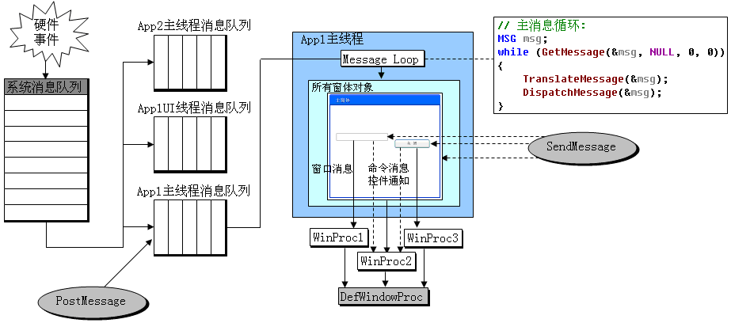
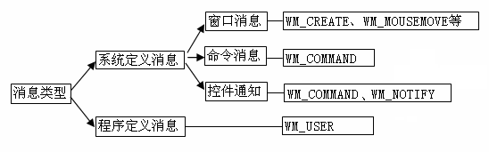
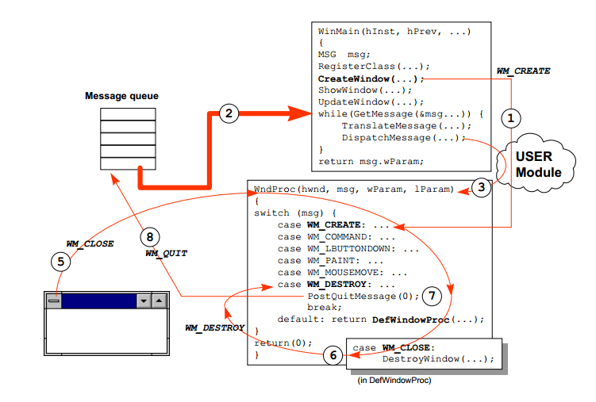

# Windows消息机制

Windows是一个**以消息为基础，以事件为驱动**的操作系统。

Windows中，计算机的所有输入设备会被一直监控着，当用户通过对鼠标，键盘操作应用程序时，系统首先会捕获该事件并将其转化成消息，并将其存放于系统消息队列中。由于操作系统知道每个消息应由哪个应用程序处理，然后消息会被拷贝到相应的窗口线程消息队列中去，同时该消息会从系统消息队列中删除。Windows程序可以不断地从自己的消息队列中取出消息进行响应，同时也可以通过消息与操作系统或其他程序进行通信。

> 当最顶层的窗口超过一定时间不响应消息时，Windows系统则会认为该窗口已经无法响应消息。在这种情况下，操作系统会把真正的窗口隐藏并替换成一个相同尺寸、位置、属性的影子窗口，使得用户可以去移动、缩放、甚至关闭程序，不至于什么都做不了。但是在debug模式的时候，操作系统不会生成影子窗口。



## 消息定义

在Windows中，消息是由一个数值表示的，不同的消息对应不同的数值，为了方便记忆，Windows将消息对应的数值定义成`WM_XXXX`形式的宏。同时系统分发给窗口处理函数的消息包含了6个参数：窗口句柄、消息标识、附带参数、发生时间和光标位置。

```c++
typedef struct {
    HWND hwnd;      //接受消息的窗口句柄
    UINT message;   //消息常量标识符（消息号）
    WPARAM wParam;  //消息特定附加信息
    LPARAM lParam;  //消息特定附加信息
    DWORD time;     //消息创建时的时间
    POINT pt;       //消息创建时的光标位置
} MSG, *PMSG;
```

## 消息类型

#### 从消息的来源来看

> 消息标识范围在0x0000 ~ 0x3FFF之间为系统定义的消息，在0x0400(`WM_USER`) ~ 0x7FFF之间则为程序自定义的消息。我们可以使用`WM_USER+x`的形式来自定义一个消息。

1. **系统定义消息**（System-Define Message）：系统在发生输入事件（用户敲击键盘、移动鼠标）时会产生消息，同时系统也可以产生消息来响应用程序带来的变化（设置系统字体）。
2. **程序定义消息**（Application-Define Message）：应用程序可以产生消息使窗体执行任务，或者与其他应用程序进行通信。



#### 从消息的发送途径上来看

> 一般来说，PostMessage发送的消息是队列消息，它会把消息Post到消息队列中，SendMessage发送的消息是非队列消息，直接送到窗口过程处理。

1. **队列消息**：消息会先保存在消息队列中，消息循环会从此队列中取出消息并分发到各窗口处理。例如：当键盘事件被触发后，相应的键盘驱动程序就会把这些事件转换成相应的消息，然后输送到系统消息队列中，由Windows系统进行处理，Windows系统则在适当的时机，从系统消息队列中取出一个消息，根据MSG消息结构确定要送往哪一个窗口，然后把取出的消息送往创建窗口的线程的相应队列中，接下来就由线程消息队列处理了。

2. **非队列消息**：消息会绕过系统消息队列和线程消息队列直接发送到窗口过程被处理，非队列消息也可以由程序调用系统函数产生。如：`WM_ACTIVATE`、`WM_SETFOCUS`、`WM_SETCURSOR`、`WM_WINDOWPOSCHANGED`（在调用SetWindowPos时产生）。

## 消息队列

为了将鼠标、键盘的消息正确地分发到各自的窗口处理，Windows系统使用到了一个先进先出的队列——消息队列。Windows系统为自己维护一个消息队列和为每个GUI线程都分别维护一个消息队列。

> 在windows 中每个消息队列最多只能存放一定数量的消息，超过的将不会被处理掉。

**系统消息队列**：这是一个系统唯一的队列，设备驱动会把输入操作转化成消息存在系统队列中，然后系统会把此消息放到目标窗口所在的线程消息队列中等待处理。

**线程消息队列**：每一个GUI线程都会维护一个线程消息队列（这个队列只有在线程调用GDI函数时才会创建，默认不创建，这是为了避免给非GUI线程创建消息队列，所有线程产生时并没有消息队列，仅当线程第一次调用GDI函数时系统才给线程创建一个消息队列），线程消息队列中的消息会被送到相应的窗口过程处理。（线程消息队列中`WM_PAINT`、`WM_TIMER`只有在队列中没有其他消息的时候才会被处理，`WM_PAINT`消息还会被合并以提高效率。其他所有消息以先进先出的方式被处理。）

## 消息发送

### 发送消息

1. **发送**：**SendMessage**、**SendMessageCallback**、**SendNotifyMessage**、 **SendMessageTimeout**。

   SendMessage会在消息处理完后才返回，如果消息不被处理，发送消息的线程将一直处于阻塞状态，等待消息处理完。

   **当同一线程内发消息时**：SendMessage不会把消息送进线程消息队列中，直接由User32.dll模块调用目标窗口的消息处理程序，并将结果返回；

   **当不同线程间发消息时**：SendMessage会把消息发送到目标窗口的消息队列中，然后发送消息的线程在User32.dll模块内监控和等待消息的处理结果，直到目标窗口处理才返回（返回前SendMessage可能还需要做一些其他工作，如响应别的线程向它发送的SendMessage）。

2. **投递**：**PostMessage**、**PostThreadMessage**、 **PostQuitMessage**。

   PostMessage把消息放到指定的窗口所在的线程消息队列中后立即返回，消息可能不被处理。不同线程间发消息时，最好使用PostThreadMessage代替PostMessage（PostMessage 的HWND参数为NULL时，相当于PostThreadMessage+GetCrrentThreadId）

3. **广播**：**BroadcastSystemMessage(Ex)**。

   我们一般接触的消息都是发送给窗口的，但其实消息的接收者还可以有很多种，如应用程序、可安装驱动程序、网络驱动程序、系统级设备驱动程序等，可以使用BroadcastSystemMessage对以上的系统组件发送消息。

### 获取消息

1. **GetMessage**：用于从消息队列取出消息并将消息从队列中删除。如果消息队列中为空，线程就会阻塞并把控制权交给其他程序，直到有消息取出，并返回正值。当取出的消息为`WM_QUIT`时，返回零。
2. **PeekMessage**：只是从消息队列中查询消息，如果有消息，则立刻返回TRUE，没有则返回FALSE。当有消息的时候，如果PeekMessage中wRemoveMsg参数中设置的是PM_REMOVE，PeekMessage会取出消息并将消息从队列中删除；若设置是PM_NOREMOVE，消息则不会从消息队列中取出。
3. **WaitMessage**：当一个线程的消息队列中没有消息存在时，WaitMessage函数会使该线程中断并处于等待状态，同时把控制权交给其它线程，直到被中断那个线程的消息队列中有了新的消息为止。

### 转换消息

1. **TranslateMessage**：每次用户按下一个按键，系统会产生一个virtual-key消息（`WM_KEYDOWN`和`WM_KEYUP`），TranslateMessage会将其转换成一个字符消息（`WM_CHAR`），并放到当前线程的消息队列中，在下一次消息循环的时候取出处理。
2. **TranslateAccelerator**：可以将快捷键对应到相应的菜单命令。它会把`WM_KEYDOWN`或`WM_SYSKEYDOWN`转换成快捷键表中对应的`WM_COMMAND`或者`WM_SYSCOMMAND`消息，然后将转化后的`WM_COMMAND`、`WM_SYSCOMMAND`消息直接发送到窗口函数处理，处理完后才返回。

## 消息死锁

假设有两个线程：线程A和线程B。当出现以下情况时：

1. 当线程A通过SendMessage发送消息给线程B时，线程A的SendMessage会等待线程B处理完后再返回。

2. 当线程B处理线程A发来的消息的过程中，线程B也通过SendMessage向线程A发送消息时，会导致线程B的SendMessage也需要等待线程A处理完后再返回。

由于两个线程相互等待SendMessage返回，从而形成死锁。为了来避免这类死锁问题，可以在使用SendNotifyMessage或SendMessageTimeout来发送消息。

## 消息循环

### 消息处理

Windows程序在运行时将会接收成千上万的消息。在程序初始化完成后，程序的主线程需要循环地调用GetMessage来获取消息队列中的消息，并使用DispatchMessage将其分发给相应的窗口。

同时每个程序可能会有多个窗口，而每个窗口都应该有一个函数函数负责消息处理，程序员必须负责设计这个所谓的窗口函数WndProc来对不同的消息作不同的响应，对于不感兴趣的消息，则可以调用系统默认的处理函数DefWindowProc来处理。WndProc实际上是一个回调函数，在注册窗口（RegisterClass）时可以通过WNDCLASS.lpfnWndProc将其传给了操作系统，当DispatchMessage分发消息时，操作系统经过User32.dll模块的协助，会自动调用正确的窗口函数去处理消息。

```c++
//程序入口
int APIENTRY _tWinMain(HINSTANCE hInstance, HINSTANCE hPrevInstance, LPSTR lpCmdLine, int nCmdShow) {
    //注册窗口
    WNDCLASSEX wcex;
    wcex.cbSize         = sizeof(WNDCLASSEX);
    wcex.style          = CS_HREDRAW | CS_VREDRAW;
    wcex.lpfnWndProc    = WndProc;   //指定窗口函数
    wcex.cbClsExtra     = 0;
    wcex.cbWndExtra     = 0;
    wcex.hInstance      = hInstance;
    wcex.hIcon          = LoadIcon(NULL, IDI_APPLICATION);
    wcex.hCursor        = LoadCursor(NULL, IDC_ARROW);
    wcex.hbrBackground  = (HBRUSH)(COLOR_WINDOW+1);
    wcex.lpszMenuName   = NULL;
    wcex.lpszClassName  = TEXT("AppName");
    wcex.hIconSm        = NULL;
    RegisterClassEx(&wcex);

    //创建窗口
    HWND hWnd = CreateWindow(TEXT("AppName"), TEXT("Title"), 
                             WS_OVERLAPPEDWINDOW, 
                             CW_USEDEFAULT, CW_USEDEFAULT, 
                             CW_USEDEFAULT, CW_USEDEFAULT, 
                             NULL, NULL, hInstance, NULL);
    
    //显示窗口
    ShowWindow(hWnd, nCmdShow);
    UpdateWindows(hWnd);
    
    //消息循环
    MSG msg;    
    while(GetMessage(&msg, NULL, 0, 0) > 0) {   //获取消息列队的消息
        TranslateMessage(&msg);                 //翻译键盘消息为字符
        DispatchMessage(&msg);                  //分发消息给窗口过程
    }
    return msg.wParam;
}

//窗口函数
LRESULT CALLBACK WndProc(HWND hWnd, UINT uMsg, WPARAM wParam, LPARAM lParam) {
	switch(uMsg) {
    case WM_CREATE: OnCreate(); break;                          //初始化窗口
    case WM_PAINT: OnPaint(); break;                            //绘制窗口
    //...
    case WM_DESTROY: PostQuitMessage(0); break;                 //退出消息循环
    default: return DefWindowProc(hWnd, uMsg, wParam, lParam);  //Windows默认处理函数
    }
    return 0;
}
```

### 消息流程



1. 在应用程序初始化的过程中，CreateWIndow函数根据参数创建窗口，但并不显示窗口，并产生`WM_CREATE`消息，该消息不经过消息队列，直接由User32.dll模块调用窗口函数处理该消息。
2. 应用程序窗口初始化完成并成功显示后，程序便会进入消息循环（while循环）。GetMessage函数将会检查消息队列中的消息，如果消息队列为空，程序则会阻塞并释放CPU控制权，让其他程序运行以达到多任务协调运行。直到发现一个合法的消息的时候，GetMessage将会返回一个正值，并获取到了该消息MSG。
3. 取出的消息将会传递给TranslateMessage函数，将虚拟键值信息转换为字符信息（这一步实际上是可选的，但有些程序需要用到这一步）。上面的步骤执行完后，将消息MSG传递给DispatchMessage函数。DispatchMessage函数将消息分发给消息的目标窗口，并调用目标窗口的窗口函数处理消息。
4. DispatchMessage分发消息时，操作系统经过User32.dll模块的协助，会自动调用窗口函数WndProc去处理消息。WndProc函数再针对不同的消息采用不同的行为作为回应。一个消息处理完成后，窗口WndProc函数返回，DispatchMessage函数返回，然后继续循环处理下一个消息。
5. 当用户点击窗口关闭按钮时，会向消息队列写入`WM_CLOSE`消息，自定义的窗口函数一般不需要处理此类消息，可以交给DefWindowProc函数作默认处理。
6. DefWindowProc在收到`WM_CLOSE`后，会调用DestoryWindow函数清除窗口，并发送`WM_DESTORY`消息。
7. `WM_DESTORY`消息的处理一般是调用PostQuitMessage函数，此函数会产生`WM_QUIT`消息并将其发送到消息队列中。
8. 当GetMessage从消息队列中取出`WM_QUIT`时，返回0，退出while循环，程序退出。
